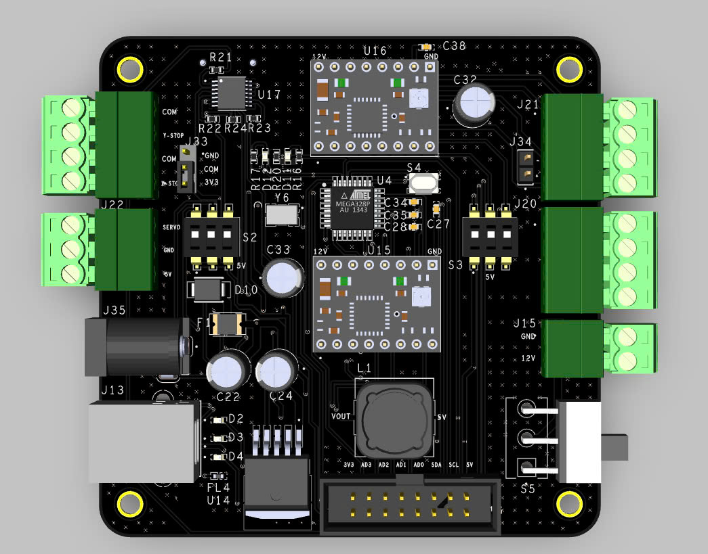
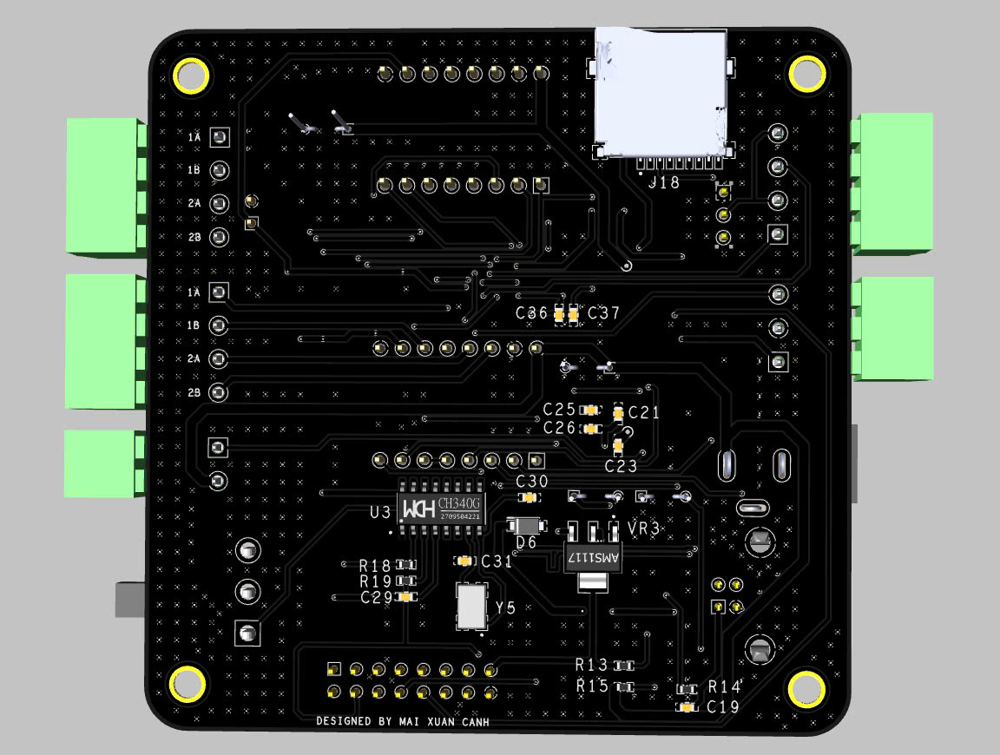
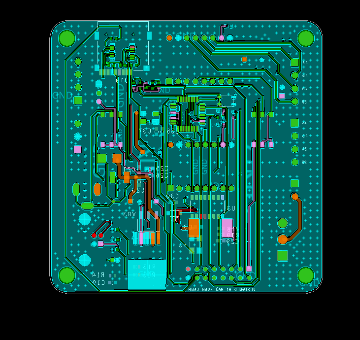
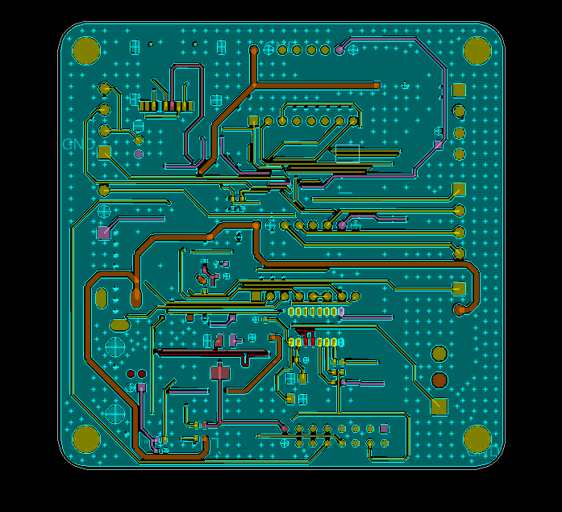
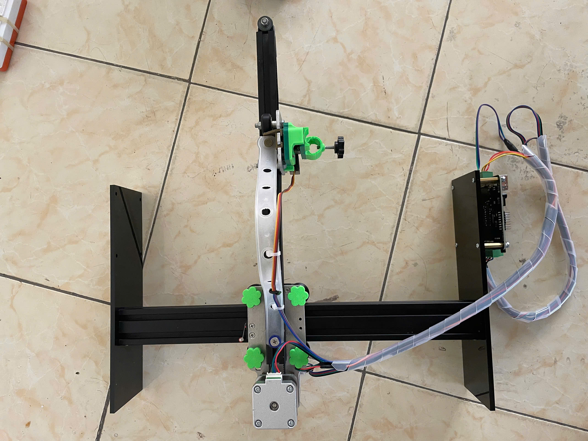
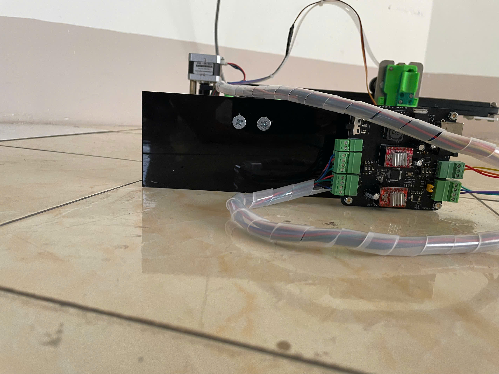
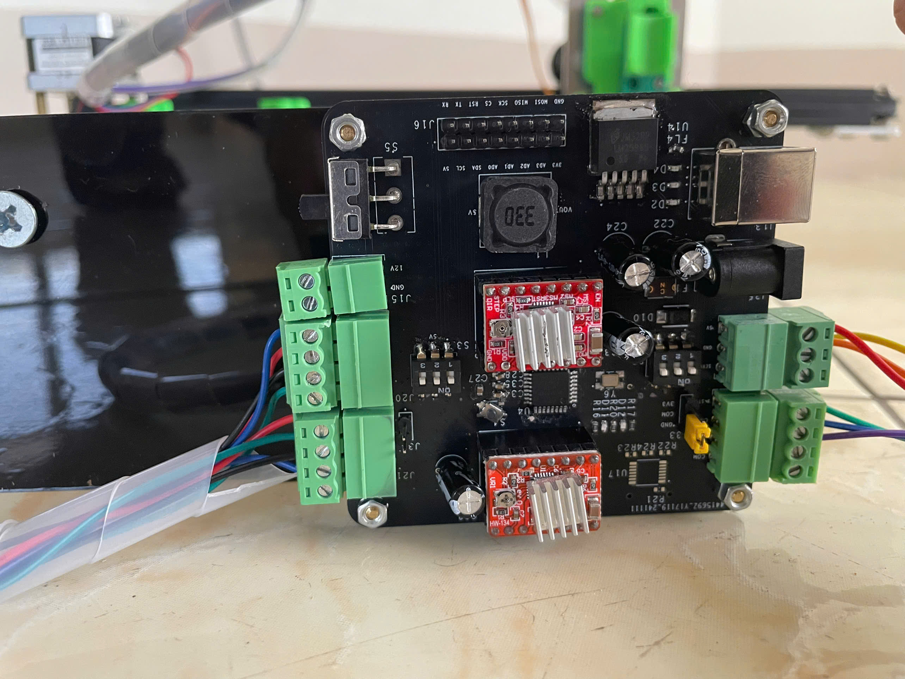
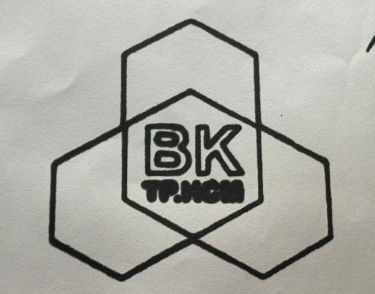

# CNC Machine Develop Board

This project, developed by **Mai Xuan Canh**, involves creating a CNC Machine control board using OrCAD/Allegro v17.4 for educational and research purposes at Ho Chi Minh City University of Technology.

## Introduction

The CNC Machine Develop Board project provides documentation and guidance for developing a control board for CNC machines. The board is designed with advanced features, making it suitable for use in compact CNC control systems.

## Product Images

Here are images of the board from different perspectives:

| View         | Image                                                  |
|--------------|--------------------------------------------------------|
| **FrontLeft**|    |
| **TOP**      |                 |
| **BOTTOM**   |           |
| **Layout TOP**      |                 |
| **Layout BOTTOM**   |           |
| **Machine TOP**   |           |
| **Machine RIGHT**   |           |
| **PCB**   |           |
| **Result**   |           |

## Key Components

1. **Microcontroller**: Processes control commands and interacts with other components of the CNC system.
2. **Drivers**: Integrates drivers to control stepper motors with high precision.
3. **Power Supply**: Provides stable power for the entire system.

## Usage Guide

1. Connect the board to CNC machine components.
2. Install CNC control software to interface with the board.
3. Test and operate the board to ensure all functions are stable.

## Software

This project is designed using **OrCAD/Allegro v17.4** for schematic and PCB design. The software enables high-precision design and effective control over the CNC machine's functionalities.

## References

- [Microcontroller Datasheet](https://ww1.microchip.com/downloads/en/DeviceDoc/Atmel-7810-Automotive-Microcontrollers-ATmega328P_Datasheet.pdf)

## Contact

For any questions or additional support, feel free to reach out:

- **Name**: Mai Xuan Canh
- **University**: Ho Chi Minh City University of Technology (HCMUT)
- **Major**: Control and Automation Engineering
- **LinkedIn**: [Canh Mai's LinkedIn](https://www.linkedin.com/in/maixuancanh2003/)
- **Email**: canhmai.work@gmail.com

---

